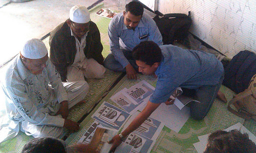
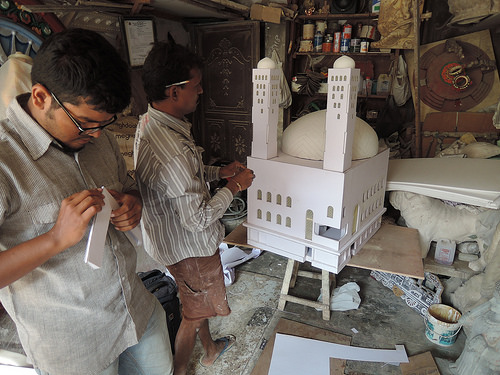
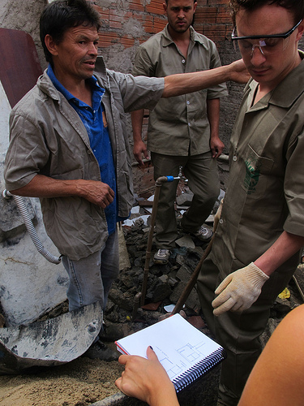
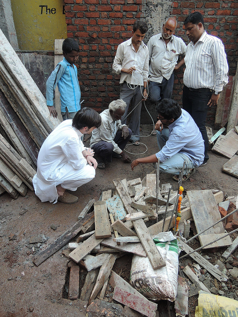

[urbz_link]: [urbz.net]
[more_photos1]: [https://www.flickr.com/photos/urbzoo/sets/72157640344961325]
[more_photos2]: [https://www.flickr.com/photos/urbzoo/sets/72157640759711095]
[more_photos3]: [https://www.flickr.com/photos/urbzoo/sets/72157633825472690]
[more_photos4]: [http://www.flickr.com/photos/urbzoo/sets/72157639521698053]

Aditya Vipparti of [URBZ][urbz_link] showing different options to Sunni Chishtiya mosque committee members in Shivaji Nagar, Govandi (Mumbai). ([More photos here][more_photos1]).

Professional practices change and adapt to the times. Some take longer to respond to new challenges while others are adept at being dynamic. A few, like architectural practice and urban planning, tend to evolve in a more ambivalent way. They are preserved and legitimized by the transmission of technical knowledge, but also aspire to be creative and visionary in bolder ways than, say, law. It is not uncommon to find well-known architectural names or urban leaders prominent in public debates on urban spaces. Their pronouncements about the world tend to be taken seriously. Their visions have the potential to shape choices people make.

Yet, the economic and institutional logic that frames such practices, weigh down the inherent creativity that exists within. Architects often complain about the world being limited by narrow choices. Their projects can be constrained by political cycles or economic downturns. Sometimes it is the local circumstances that seem hostile or too messy. Or it is their client’s taste that is the cause, affected as it is, by popular culture or an apparently irrational faith in old-fashioned ways of building.

Architectural studios, offices and publications are often full of futuristic and visionary images about the way the world and its constituent buildings should look like. These speculative designs seem to be floating in space, free from the constraints of the lived world. That these designs tend to rehearse clichéd notions of the future that have all been seen already in B-grade science fiction is not what we are most concerned about. What is more preoccupying is that even talented architects, who have the ability of imbuing meaning and possibly even beauty to their work, often get frustrated when it comes to inserting their vision into a piece of urban reality. Their exigencies then become about reproducing the impossible condition of the blank Autocad document into the lived world: No financial limitation, clean square plots, obedient and invisible workers, and ideally no client – or a rich client that keeps quiet.

Unfortunately, these conditions are not available, especially in the world of the proverbial “99%”. The environment of choice for many architects who want a faithful rendition of their visions thus include galleries, biennials and classrooms, which keep the messiness of everyday life at bay. The same architects land up in teaching positions, inculcating generations of students with a certain scorn for the world that they are supposed to contribute building.

The mismatch between the world out there and the way architects are trained has produced the most bizarre amount of speculative drawings that have no connection whatsoever with anything alive. For the most part, architectural education assumes that the tabula rasa is an available condition. But when can we ever start anything from scratch? Every place has a pre-existing ecology and history, as well as on-going social dynamics. These conditions define any built space, whether we want it or not. Tabula rasa is the primmest of all architectural utopias.

The desire to reproduce the condition of the white page, where supposedly the creative input of the architect is unconstrained, has lead to the cult of starchitects, who seem to be the only ones in this world who have enough aura to impose their grand design visions. On a closer look however, even a Koolhaas or a Gerry are constrained by power structures above them. Their agency is always tempered, in ways that would hurt the vision of idealists. This is why most starchitects cannot afford to be purists in action. They are well aware of the trade off between getting grand commissions and being free to express their individual agency. What comes out as frustration for the greater number of architects, becomes cynicism for those at the top of the professional hierarchy.

Yet, there are a variety of entry points available to anyone willing to engage with the exigencies of the living world. We want to examine what could the architect in particular do to respond to these challenges.

Model for the Ahle Sunat mosque in Baiganwadi, designed in collaboration with Torino architects Studio Marc. The model maker, Sanjay Sonawane is an artist and sculptor in Shivaji Nagar, here with Shardul Patil of URBZ. ([More photos here][more_photos2]).

It has become very common to see students of architecture take their learning from the university into the world – only to find that it doesn’t quite match. Living contexts are dynamic and multi-dimensional in ways that routinized learning just does not prepare them for, while their own individual personalities and choices create other uncertainties.
It can be argued that the full potential and genuine possibilities are not presented to them so the paths laid out to them appear limited. For example, in a highly competitive professional world, aspiring architects often find that work is scarce. And yet – the amount of construction going on around the world is enormous.

The thing is, a lot of it is taking place outside the radar of known professional choices. Millions of people build their own homes with the help of local construction workers without the help of architects, simply because the conventions of construction, their occupancy status, the political location of these settlements is not one that most architects are willing to negotiate.
It is also true that students of architecture and other urban practitioners can be found in favelas of Latin America, and settlements of Africa and Asia in fairly significant numbers. But rather than only channelizing their surplus energy of goodwill – like barefoot architects – what would go a longer way is a little re-arrangement of professional practices.

Work environments in this day and age are located in the interstices of many new configurations and fault lines. The virtual, spatial and temporal collapse of experience has become part of everyday reality.

A small contractor working in a homegrown settlement in Mumbai has access to the Internet, some robust local finance and the needed political support to start a project. An office in far away Torino can connect with him to produce a conversation that in the near future can become a wholesale professional arrangement. A pedreiro from Sao Paulo may want to make a visit to India and compare construction techniques. Researchers working on new material technologies in Boston can experiment with live applications where it matters most. A practicing architect from anywhere can mediate all such conversations.

Contractor Ataide Caetite in Paraisopolis, Sao Paulo, where he is building his own home with the help of the local URBZ team. ([More photos here][more_photos3]).

Of course – for this to become a reality, an emergence of a new kind of politics is also important. The role that architects can play even in this regard is very significant. Politics is imbued with idealism and idealism needs visions which architects of today are specially trained to provide. The only reason they have not stepped into that space with more confidence is because they are constrained by professional considerations and economic concerns. Even while millions of residents around the world keep doing what the known professional world also does – finance and build homes.

The tools for reaching out to this world are already there. Why not shape and sculpt an architectural practice specifically for the living world and living subjects?

Maybe the only reason not many are jumping onto this bandwagon is because of a paucity of visualizing the future for such a world. For some reason, the present in architectural practice is intertwined with visions of the future and there seems to be no appealing horizon for the world that these millions are aspiring for. That’s why the voices and exuberant energy seem to be easily and abruptly dissipated on Youtube videos after every surge of protest.

And yet – if you google images of an architecture of the future – and examine what you get, you will discover a mirror set of images from the results of a similar search for medieval architecture. Either way, you get images as disconnected from the living present as you can possibly imagine.

Maybe this is where architectural practice as we know it today is trapped in. A timeless zone, firewalled from the living present, which is a reality for hundreds of million people around the world. To escape such a predicament, all one has to do is what most of us so easily do in this day and age. Get connected.

Yet, connecting to the lived world is not as easy as it sounds, especially for those in the architectural professions that have taken comfort in their labs and studios. Connection means the establishing of a relationship that has the potential of destabilizing certitude and comfort zones. This is because, the feedback one gets from the field, from people, is less polite than a Facebook poke and more real than a symposium. The kind of connected practice we think about is based on the realization that knowledge flows in more than one way; that there is a tremendous amount of intelligence to be gathered in worlds that were once only thought of as too distant, hopeless or backward.

For the architectural practitioner, this necessarily implies another relationship to his own creative agency. It is not about imposing one order onto another, or bringing more rationality into an existing local practice of construction. The authority of the architect as an expert in design, material and structure can only be played out when it is connected with the knowledge of other actors who are rooted in their imminent reality. What happens otherwise is mutual dismissal. The context and the actors reject architectural design as being incompatible with their reality. The architect rejects the context as one that doesn’t have the channels in place that allow him to express his professional expertise. This is a loss both ways.

Why should architectural practitioners have to reproduce the same inflexibility and directive approach as some of their own patrons, only to find themselves being frustrated by the fact that unlike those powerful players, they don’t have the means of imposing their vision onto a defiant world?

So what would “live architecture” be like? What does it mean to practice an architecture that doesn’t require a contextual vacuum to express itself? One that acknowledges the depth of any departure point, and the nonlinearity of the process?

This would not be a utopian architecture. It would rather be something between pragmatism, boldness, optimism and playfulness, emerging from whatever exists while drawing inspiration from it. Even if it aims at totally subverting all that’s there, the living present still provides its starting and ending points.

URBZ teamsters Giacomo Ardesio, Shardul Patil, and Bharat Gangurde on the site of a Shiva Temple in Shivaji Nagar (Govandi) with shuttering contractors. ([More photos here][more_photos4]).

Connected to the context would mean more than using the physical reality as a backdrop for clever designs. The context, however fucked up, (or fuckable as some repeatedly like to say) is ultimately the most creative and challenging of social, economic and psychological canvases. Avoiding a messy collaboration with what is in there is a cop-out and can only produce more outdated and anachronistic architecture that hides behind easy labels.

The biggest threat for an established architect, when engaging with such a live architectural process is that one can never be sure of the outcome. If the outcome is a built object, then one has to accept that the way it ends up looking may not quite be what the architect initially had in mind. Some of his ideas may be reinterpreted along the way to become something else altogether. This means that the agency of the architect should no longer be limited to producing a design that must be executed precisely. And the agency of others can play with that of the architect. All this must not be suffered through. Rather, they must be acknowledged as objective and subjective forces that one must use to compose with. The respect and non-hierarchical relationship that such a process promotes are ethical, aesthetic and pragmatic at once. They are based on the recognition that mere imposition of a design is neither desirable nor possible.

Is all this possible or desirable? Only experiments will tell. The biggest challenge in this process seems to be to connect worlds that have taken comfort in ignoring each other for so long. It may be a bumpy ride, but one full of the kind of thrill that even Autocad can’t provide!